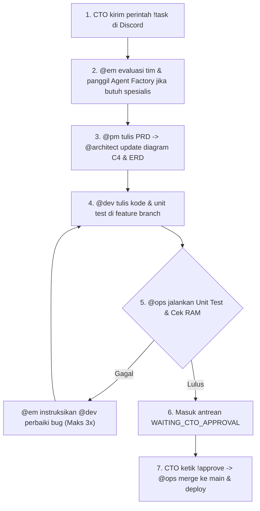

# 2. Alur Kerja Sistem & Sequence Diagram

> Dokumentasi alur eksekusi fitur, *self-healing loop*, serta alur endpoint aplikasi utama.

## Alur Eksekusi Fitur & Gerbang Approval CTO

```mermaid
flowchart TD
    S1["1. CTO kirim perintah !task di Discord"]
    S2["2. @em evaluasi tim & panggil Agent Factory jika butuh spesialis"]
    S3["3. @pm tulis PRD -> @architect update diagram C4 & ERD"]
    S4["4. @dev tulis kode & unit test di feature branch"]
    S5{"5. @ops jalankan Unit Test & Cek RAM"}
    SFix["@em instruksikan @dev perbaiki bug (Maks 3x)"]
    S6["6. Masuk antrean WAITING_CTO_APPROVAL"]
    S7["7. CTO ketik !approve -> @ops merge ke main & deploy"]

    S1 --> S2
    S2 --> S3
    S3 --> S4
    S4 --> S5
    S5 -->|"Gagal"| SFix
    SFix --> S4
    S5 -->|"Lulus"| S6
    S6 --> S7
```
